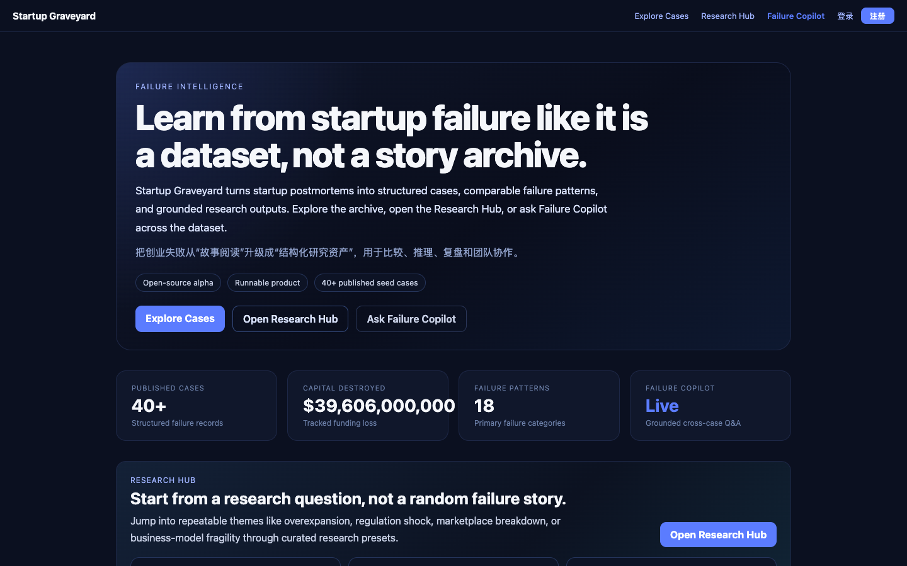
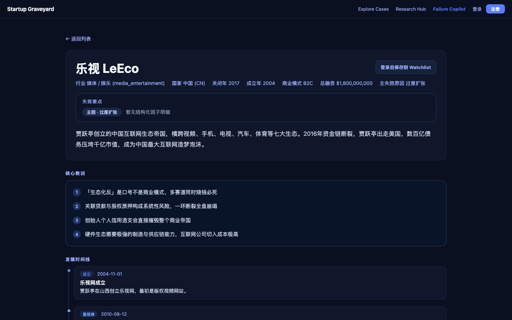
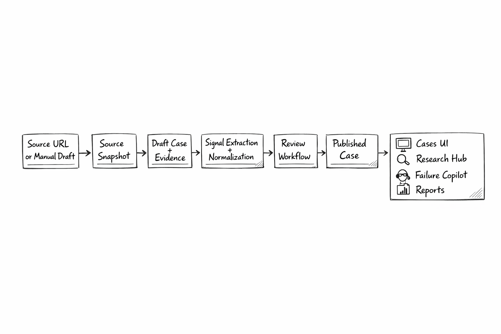
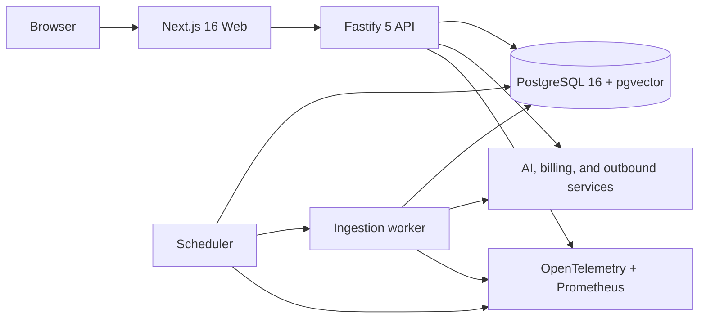

# Startup Graveyard

Failure intelligence for founders, investors, and research teams.

[](https://github.com/dataPro-lgtm/startup-graveyard/actions/workflows/ci.yml)
[](./LICENSE)

Startup Graveyard turns startup postmortems into structured, comparable research assets. It combines a public case library, grounded analysis, reusable research outputs, and an evidence-gated publishing workflow.



## Product

| Area                  | What it provides                                                                                              |
| --------------------- | ------------------------------------------------------------------------------------------------------------- |
| Case Explorer         | Filter 40 curated startup failures by industry, geography, business model, closure year, and failure pattern. |
| Research Hub          | Start with repeatable research topics and compare patterns across cases.                                      |
| Failure Copilot       | Ask archive-grounded questions with case-level context and graceful provider degradation.                     |
| Research outputs      | Save views, maintain a watchlist, export Markdown or PDF briefs, and publish shareable links.                 |
| Team Workspaces       | Share cases and saved views with role-aware workspace access and subscription controls.                       |
| Publishing operations | Capture sources, attach evidence, normalize signals, review drafts, publish cases, and rebuild indexes.       |



## Case Lifecycle

Every published case passes through the same evidence and review path.



1. Capture a source URL or create a manual draft.
2. Preserve source snapshots and attach supporting evidence.
3. Extract and normalize failure signals.
4. Review evidence quality and publication readiness.
5. Publish the case and make it available to search, reports, and Copilot.

## Architecture


```mermaid
flowchart LR
    Browser["Browser"] --> Web["Next.js 16 Web"]
    Web --> API["Fastify 5 API"]
    API --> DB[("PostgreSQL 16 + pgvector")]
    Worker["Ingestion worker"] --> DB
    Scheduler["Scheduler"] --> DB
    Scheduler --> Worker
    API --> Services["AI, billing, and outbound services"]
    Worker --> Services
    API --> Telemetry["OpenTelemetry + Prometheus"]
    Worker --> Telemetry
    Scheduler --> Telemetry
```

The API, ingestion worker, and scheduler run as separate production processes. PostgreSQL is the system of record for cases, identities, workspaces, jobs, runtime heartbeats, and alert delivery state. See the [target architecture](./docs/COMMERCIAL_PRODUCT_ARCHITECTURE.md), [deployment baseline](./docs/DEPLOYMENT.md), and [observability runbook](./docs/OBSERVABILITY_RUNBOOK.md) for operating details.

## Quick Start

### Prerequisites

- Node.js 22
- pnpm 10
- Docker Desktop or a compatible Docker Engine with Compose

```bash
corepack enable
pnpm install
cp .env.example .env
make db-reset
make dev
```

Open the product at:

- Web: `http://127.0.0.1:3000`
- Research Hub: `http://127.0.0.1:3000/research`
- Failure Copilot: `http://127.0.0.1:3000/copilot`
- API documentation: `http://127.0.0.1:18080/docs`

The public research experience works without AI or billing credentials. Add `OPENAI_API_KEY` or `ANTHROPIC_API_KEY` for generated Copilot answers and the relevant `STRIPE_*` values for subscription flows. Production configuration is documented in [docs/DEPLOYMENT.md](./docs/DEPLOYMENT.md).

## Repository Map

```text
apps/web/                 Next.js product and admin interfaces
services/api/             Fastify API, worker, scheduler, and domain services
packages/shared/          Shared schemas and domain contracts
packages/contracts/       OpenAPI specification
db/migrations/            Ordered PostgreSQL migrations
db/seed/                  Idempotent demo and evaluation data
e2e/                      Playwright release journeys
ops/docker/               Production container definitions
ops/observability/        Prometheus configuration and alert rules
docs/                     Architecture, deployment, operations, and roadmap
```

## Quality Gates

Use the fast gate while developing:

```bash
make ci
```

Use the release gate before merging:

```bash
pnpm exec playwright install chromium
make ci-full
```

`make ci-full` adds real PostgreSQL integration tests, production browser journeys, and Prometheus configuration validation. GitHub Actions runs the same release layers and exposes `CI OK` as the aggregate status.

## Project Status

Startup Graveyard is a runnable alpha with 40 curated seed cases. The public research journey, evidence-gated publishing, personal research outputs, Team Workspace collaboration, production containers, isolated background runtimes, and operational telemetry are implemented and covered by release tests.

The current limits are explicit:

- The dataset is suitable for product validation, not broad market coverage.
- AI and billing integrations require operator-owned provider accounts and production credentials.
- The included deployment model is a single-host production baseline, not a managed multi-region platform.
- Data quality, offline Copilot evaluation, Stripe lifecycle validation, and business SLOs remain active roadmap work.

Current priorities and acceptance criteria are tracked in the [product execution plan](./docs/PRODUCT_EXECUTION_PLAN.md).

## Contributing

Read [CONTRIBUTING.md](./CONTRIBUTING.md) before opening a pull request. Contributions are particularly useful in case evidence, taxonomy quality, research workflows, evaluation coverage, and reliability.

Please report security issues through the private process in [SECURITY.md](./SECURITY.md), not through a public issue.

## License

Released under the [MIT License](./LICENSE).
