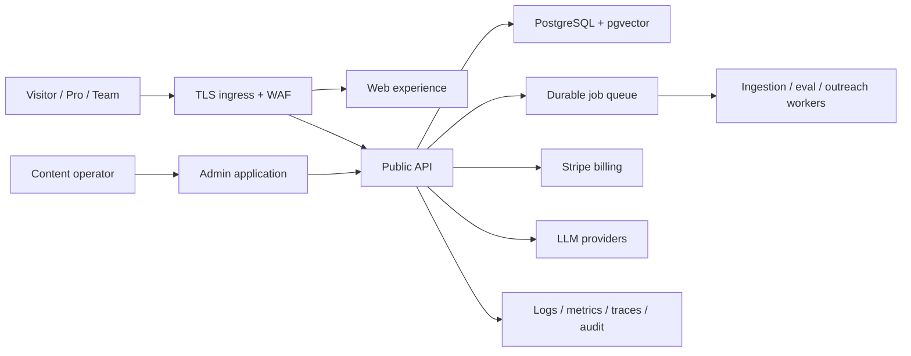

# Commercial product target architecture

## 1. Product position

Startup Graveyard should mature into a failure-intelligence workspace, not a case-content website. The paid value loop is:

`trusted evidence -> structured failure model -> reusable research asset -> team decision -> measurable risk reduction`

The product is commercially ready only when a new customer can discover value, pay, complete research, collaborate, and recover from billing or provider failures without operator intervention.

## 2. Target system boundary

API, worker, and scheduler must become separately deployable processes. PostgreSQL remains the transactional source of truth; external provider calls are idempotent side effects driven by durable jobs.

## 3. Maturity scorecard

| Dimension                 | Current production baseline                                                       | Commercial exit standard                                                                        |
| ------------------------- | --------------------------------------------------------------------------------- | ----------------------------------------------------------------------------------------------- |
| Value and activation      | Public research, Saved Views, exports, Copilot, Team sharing                      | First useful research asset within 10 minutes; activation and retention measured by plan        |
| Identity and security     | HttpOnly Cookie browser session, bearer compatibility, CORS allowlist, throttling | Device sessions, revocation, tenant matrix, application admin roles, security event audit       |
| Billing                   | Pro/Team checkout, portal, webhook state sync, recovery workflow                  | Replay-safe Stripe lifecycle tests for upgrade, downgrade, past due, cancellation, and recovery |
| Reliability               | CI, PostgreSQL and browser release gates, health endpoints                        | Separate workers, SLOs, traces, alert routes, backup/restore and rollback exercises             |
| Data and AI trust         | Evidence workflow, citations, eval snapshots and regression detection             | 200+ governed cases; nightly quality gate with groundedness, citation and fallback thresholds   |
| Compliance and operations | Admin audit and deployment baseline                                               | Retention policy, user export/delete, secret rotation, incident runbooks and access reviews     |

## 4. Delivery sequence

### C1: Security and tenant boundary

- Complete cross-tenant read/write denial tests for every Team asset.
- Replace shared Admin API key usage with named operator identities and scoped roles.
- Add device/session inventory, selective revocation, session audit events, and credential rotation.

Exit: every authenticated resource has owner/member/non-member/admin negative tests, and browser credentials are never script-readable.

### C2: Billing correctness

- Store Stripe event IDs and reject duplicate side effects.
- Add sandbox fixtures for checkout, upgrade, downgrade, past due, cancellation, and recovery.
- Introduce retry/dead-letter handling for Stripe and outbound recovery actions.

Exit: replay and provider failure injection cannot corrupt entitlements or send duplicate outreach.

### C3: Runtime reliability

- Split API, scheduler, ingestion, eval, and outreach workers.
- Add OpenTelemetry traces, RED metrics, queue age, provider latency, and business SLOs.
- Exercise migration rollback policy, PostgreSQL restore, and degraded-provider operation.

Exit: an unhealthy worker or provider does not take down reads, authentication, or billing state.

### C4: Data, AI, and growth

- Scale governed evidence coverage and make freshness/quality visible to users.
- Gate Copilot releases on offline eval and citation accuracy.
- Instrument acquisition, activation, paid conversion, retained research assets, and Team collaboration.

Exit: product investment decisions can be made from trusted cohort and quality metrics rather than feature output.

## 5. Architecture rules

- No external side effect without an idempotency key, persisted attempt state, timeout, retry policy, and audit record.
- No tenant-owned resource without an explicit authorization policy and negative test matrix.
- No commercial metric without a stable definition, source event, owner, and alert threshold.
- No AI answer presented as grounded unless citations resolve to published evidence used during generation.
- No production release based only on mocks; PostgreSQL, browser, migration, and container gates remain mandatory.
